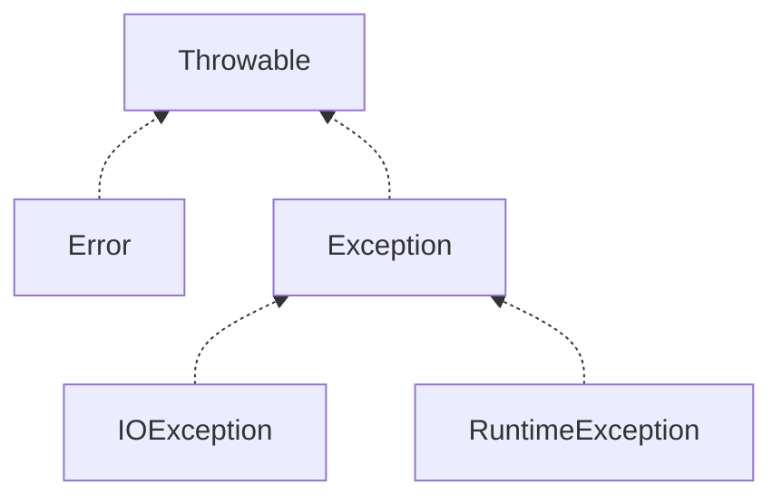

程序执行时，运行环境的许多因素会影响到程序的正常运行，例如网络是否连接、文件是否存在等等，Java中使用异常机制来帮助程序编写者处理这些理想之外的意外情况.

<!-- more -->

## Java中异常类的层次结构

---

Java中预定义异常的主要机构：



所有的异常类都继承自`Throwable`类，`Error`与`Exception`是`Throwable`的直接子类，其中`Error`异常一般是在系统发生内部错误时抛出.

`Exception`下又有两大常见的异常`RuntimeException`和`IOException`，其中：

**`RuntimeException`即运行时异常，通常在程序本身发生错误时自动抛出，例如：**

- 访问一个对象的方法时，对象为`null`，抛出空指针异常`NullPointerException`
- 访问数组的下标超过了数组的实际长度，抛出数组下标越界异常`ArrayIndexOutOfBoundsException`
- 错误的进行强制类型转换，抛出类型转换异常`ClassCastException`

**`IOException`是程序运行时，由于外界因素导致的I/O操作异常，例如：**

- 访问的文件不存在，抛出`FileNotFoundException`异常
- 到达文件结尾，继续读取抛出`EOFException`异常

### checked与unchecked异常

Java中分为checked与unchecked两种异常，其中unchecked异常可以不进行处理，而checked异常必须进行捕获处理(或者向上层抛出)

- `Error`与`RuntimeException`异常均属于unchecked异常，程序中不强制对它们进行处理
- 除此之外的异常属于checked的异常，这些异常必须被处理

## 异常处理

在进行方法调用时，如果方法声明了可能会抛出unchecked异常，则需要进行异常捕获或者继续向上抛出.

### 异常捕获

Java中使用try语句包围可能发生异常的语句，再使用catch子句对相应类型的异常进行捕获：

```java
File file = new File("demo.txt");
try {
    file.createNewFile();
} catch (IOException e) {
    // 打印堆栈轨迹
    e.printStackTrace();
}
```

catch中明确表明需要捕获的异常类型，这样可以捕获声明的异常类型及其子类型，如果需要，可以使用多个catch子句来捕获不同的异常：

```java
try {
    FileInputStream fileInputStream = new FileInputStream("demo.txt");
} catch (FileNotFoundException e) {
    e.printStackTrace();
} catch (IOException e) {
    e.printStackTrace();
}
```

使用多个catch子句时，需要注意，当方法抛出异常时，会根据catch中声明的异常类型，按照定义的顺序，挨个寻找异常处理器，一旦寻找到合适的处理器，就立即应用而不再向后继续搜寻，因此，越具体的异常，应该越靠前进行声明.

除此之外，自JDK1.7起，如果对待多个异常，希望使用相同的逻辑来处理，可以在catch子句中声明多个异常：

```java
try {
    exceptionTest();
} catch (ExceptionA | ExceptionB e) {
    e.printStackTrace();
}
```

### finally子句

当代码中发生异常时，异常发生位置后面的语句不再运行，此时程序直接跳转到相应的catch子句中. 如果希望有些语句始终会被执行，而不会受异常影响(例如释放被占用的资源)，可以使用finally子句：

```java
FileInputStream fileInputStream = null;
try {
    fileInputStream = new FileInputStream("demo.txt");
} catch (IOException e) {
    e.printStackTrace();
} finally {
    if (fileInputStream != null) {
        // 关闭文件输入流
        try {
            fileInputStream.close();
        } catch (IOException e) {
            // ignore this
        }
    }
}
```

使用finally子句，需要留意几点：

- try语句可以只包含finally子句，而没有catch子句
- 在一个try语句块中，finally始终最后执行
- 如果finally中有返回语句，则其返回的值会始终覆盖try语句中的返回值
- 如果finally中抛出异常，则会覆盖try或者catch语句中抛出的异常

### 带资源的try语句

我们经常使用try/finally组合语句来打开和关闭一个资源的输入输出流：

```java
try {
    // open a I/O stream
} finally {
    // close the opened I/O stream
}
```

这样的结构可以保证资源被正确的释放，自JDK 1.7起，可以使用带资源的try语句来简化这一点：

```java
try (IOStream stream = ...) {
    // do something with stream
}
```

使用带资源的try语句时，资源会自动的被关闭(即资源的`close()`方法会自动的被调用)，但前提是，**这个资源类实现了`AutoCloseable`方法**，例如对于之前打开文件输入流的例子，现在可以使用带资源try语句对其进行简化：

```java
try (FileInputStream fileInputStream = new FileInputStream("demo.txt")) {
    // do something
} catch (IOException e) {
    e.printStackTrace();
}
```

对于带资源的try语句，当程序离开try语句时，会自动调用资源的`close()`方法，还有一点与一般try语句不同的是，带资源try语句后的catch语句同样也可以用来捕获`close()`方法执行时抛出的异常：

```java
try (FileInputStream fileInputStream = new FileInputStream("demo.txt")) {
    // do something
} catch (IOException e) {
    // 如果自动关闭时，fileInputStream.close()方法抛出异常，则会在这里捕获
    e.printStackTrace();
}
```

还有一种情况，如果try语句也同时抛出了异常，调用`close()`方法抛出的异常不会覆盖try语句中待抛出的异常，而是被自动的添加到原来异常的suppressed的异常列表中(异常对象有个`addSuppressed()`方法，可通过该方法向目标异常中添加`suppressed`异常).

### 向上抛出异常

有时候，发生异常时不应该立即捕获处理，应该交由调用者来决定如果处理该异常，此时可以将异常向上抛出. 此时只需要在方法后声明可能抛出的异常列表即可(多个异常使用`,`隔开)：

```java
private void method() throws ExceptionA, ExceptionB {
    // method body
}
```

## 自定义异常与手动抛出异常

---

### 自定义异常

Java预定义的异常经常不能满足实际的业务需求，此时可以根据需要进行自定义异常.

自定义异常时需要继承`Throwable`，通常的自定义异常都直接实现`Exception`或`RuntimeException`：

- 如果自定义的异常需要强制被处理，则可以继承`Exception成为checked异常`
- 如果不需要强制处理，则可以继承`RuntimeException`成为unchecked异常

例如自定义一个网络连接失败异常：

```java
class NetworkConnectedFailedException extends Exception {
    public NetworkConnectedFailedException(String message) {
        super(message);
    }
}
```

### 手动抛出异常

当发生错误时，我们可以根据需要手动抛出一个异常，来通知调用者进行处理，Java中可以使用`throw`关键字来抛出一个异常对象：

```java
if (time > MAX_CONNECT_TIME) {
    throw new NetworkConnectedFailedException("网络连接超时");
}
```

当然，在一个方法中手动抛出一个异常后，需要在方法后声明将会抛出的异常列表：

```java
public void connect() throws NetworkConnectedFailedException {
    ...
    if (time > MAX_CONNECT_TIME) {
        throw new NetworkConnectedFailedException("网络连接超时");
    }
    ...
}
```

## 包装异常

---

有时候，我们的方法中不需要关注底层抛出了何种异常，而应该将底层的异常根据业务需要，封装成我们自己的异常，对一场进行二次包装，变成符合我们自己需要的异常即为**包装异常**，包装异常的意义在于，我们想要抛出自己的异常，同时又不想丢失引起异常的信息. 通过异常对象的`initCause(Throwable cause)`方法即可将原始异常存入新建的异常中，例如：

```java
public void open() throws OpenFileFailedException {
    try (FileInputStream fileInputStream = new FileInputStream("demo.txt")) {
        // do something
    } catch (IOException e) {
        OpenFileFailedException exception = new OpenFileFailedException("文件打开失败");
        exception.initCause(e);
        throw exception;
    }
}
```

## 断言

---

异常的存在是为了帮助我们处理程序运行期间发生的意外情况，而断言是为了声明程序能够正确执行的先决条件. **断言只用于程序的开发测试阶段.**

### 使用断言

Java中使用`assert`关键字来声明断言，有两种格式的断言

```java
assert condition;
assert condition : expression;
```

断言声明语句中，`condition`是一个条件表达式，该表达式返回`true`或者`false`， 返回true，则表示符合条件，程序继续向下执行，返回false则会抛出`AssertionError`异常.

`expression`用于定义错误信息，它可以是字符串，或者能够转化为字符串的对象.

例如：

```java

public int getSalary(int hours) {
    assert hours > 0;
    // 如果需要更详细的提示，使用下面这种格式的断言
    // assert hours > 0 : "时间不能为负数: " + hours;
    return hours * 10;
}
```

**注意：断言默认是关闭的，需要在程序运行期间指定虚拟机参数`-ea`来打开断言(如使用`java -ea`来执行程序).**

