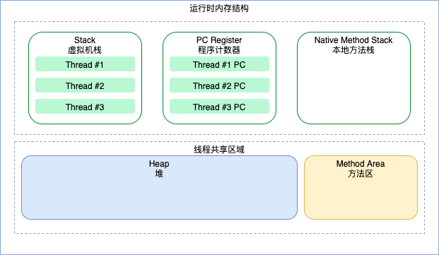
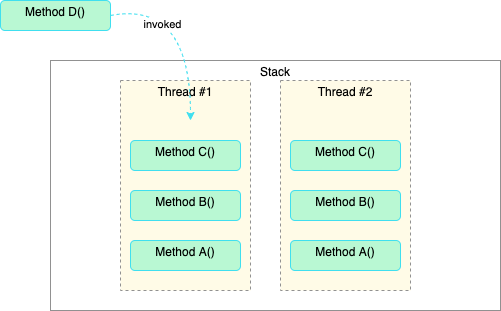

---

## 内存管理的烦恼

内存需要申请，使用完毕需要释放，何时释放？由谁来释放？释放时如何确认该内存区域存的是垃圾数据？这些麻烦在引入多线程后，又将继续变得复杂：CPU 缓存与主存数据不一致问题、指令有序性问题等等诸如此类。JVM 的自动内存管理缓解了这个烦恼，Java 内存模型对并发相关的问题提供了方案，为了实现自动内存管理，JVM 需要定义自己的内存布局，以此给预分配的内存划分区域，在运行时提供不同的作用。

<!--more-->

## JVM 运行时内存结构



其中**堆 heap**与**方法区**是线程间共享，而**栈 Stack** 与**程序计数器**是按照线程划分隔离，**本地方法栈**是指调用本地方法（Java 中的 Native 方法）使用的栈，与**栈 Stack**性质类似。

### 程序计数器 PC Register

Program Counter Register 程序计数器，用来存储下一条指令的位置，每个线程各自有一个 PC Register，每当线程被唤醒时，就可以根据计数器的数据，从上次指令的位置恢复执行。

### 栈 Stack

**栈**有虚拟机栈和**本地方法栈**两种，都是线程调用方法时，存放栈帧的地方，HotSpot 虚拟机中，这两个栈合二为一。



栈的大小可以通过参数设定 `-Xss`，如设置栈大小为 2m：`-Xms2m`。

### 堆 Heap

**堆**是 Java 内存区域中最大的一块，会被 GC 收集器管理，因此也叫 **GC 堆**。该区域存放 Java 对象实例，由所有线程共享。

该区域的一些控制参数：

```shel
-Xms # 设置堆的初始容量 -Xms128m
-Xmx # 设置堆的最大容量 -Xms1g
```


### 方法区 Method Area

在《JVM虚拟机规范》中，**方法区**被定义为在逻辑上是**Java 堆**的一部分：

> the method area is logically part of the heap

因此可以理解为该区域也在堆中，但为了区分也称为**非堆 Non-Heap**，和**堆**不一样，方法区中的数据不强制回收，这点根据虚拟机实现而定。

方法区中存放**已加载的类信息**、**常量池**数据等。


### 运行时常量池 Run-Time Constant-Pool

**常量池**数据存储在**方法区**中，用于存放编译以及运行时产生的高频使用的常量数据，如代码中出现的字符串常量，Java 库中的一些接口也可以实现在运行时向常量池中存储数据，如 `String.intern()`。


### 直接内存

Java 运行时，除了 JVM 管理的那部分内存外，还会有直接内存 (Direct Memory) 产生，该内存不受 JVM 管控，直接在宿主机内存上分配，例如 NIO 中使用 Cha nnel 与 Buffer，会通过 Native 方法直接分配堆外内存。


## OutOfMemory 异常与 StackOverFlow 异常

**OOM** 会在**堆**与**方法区**无可用空间时抛出，**StackOverFlow**异常是方法调用深度过大，导致栈被栈帧填满，无法继续分配，抛出异常。


## 参考

- 《深入理解 JAVA 虚拟机》第三版，周志明
- [Java Virual Machine Specification SE8](https://docs.oracle.com/javase/specs/jvms/se8/html/index.html)
