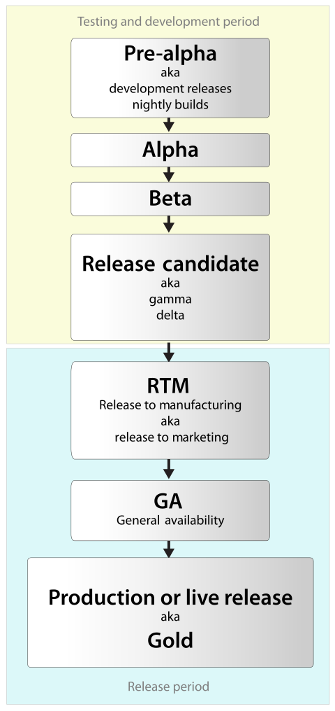

---

一个软件的开发至完成的生命周期如下：

<!--more-->

## 开发测试版本 (Devepopment Stages)

### Pre-alpha

Pre-alpha 版本尚未开始第一次测试，处于开发和功能完善阶段。

### Alpha

Alpha 版本处于第一次测试阶段，或内部测试阶段，该版本会进行白盒、灰盒测试、黑盒测试，直至软件的功能全部测试完成。

### Beta

完成第一轮全部功能测试后，软件开发周期进入 Beta 版本，该版本中将进行第二轮测试，一般是一些 bug 修复或功能优化， Beta 阶段可以根据情况发布公测版本。

### RC (Release candidate)

Beta 阶段最后一轮测试完成后，就进入 RC 版本，RC 版本基本没什么问题了，可能会有一些小修小补，是准稳定版。

### Stable release

Stable release 即是稳定版或生产版本，**该版本为正式发布版本**，有些软件会将稳定版分两类：

- **normal release** 该版本会进行一段时间的维护(可能维护几个月)
- **LTS release** (**L**ong **T**erm **S**upport)长期支持版本, 该版本会长期进行维护(一般几年) 

## 发布版本

软件正式发布后，可以根据发布方式来正式命名发布的版本名称：

### RTM (Release to manufacturing)

用于批量生产包装的版本(比如用来刻录到光盘里)。这个版本在 **GA** 版本之前。

### GA (General availability)

正式通过 CD 或网络等方式发布的版本。**RTM** 之后就是 **GA** 版本。

### RTW (Release to the Web)

通过网络发布的版本。

**RTM、GA、RTW 都是正式发布的版本，和 Stable release 版本没有区别。**只是发布方式和渠道有些差异，因此取了不同的名称来区分。

## 参考

1. https://www.wikiwand.com/en/Software_release_life_cycle

