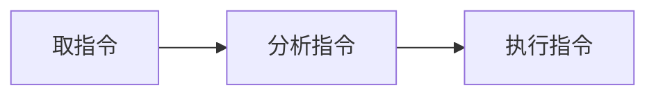
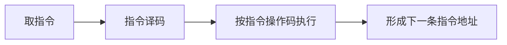

---

## 组成计算机的基本硬件

运算器、控制器、存储器、输入设备、输出设备。

<!--more-->

## CPU 中央处理单元

**C**enter **P**rocessing **U**nit 中央处理单元，简称 CPU，是计算机的核心部件。

### CPU的主要功能

- 程序控制 - CPU 通过执行指令来完成一系列的动作
- 操作控制 - CPU 执行指令的会产生操作信号，送往对应部件
- 时间控制 - CPU 对动作发生的时间点、时长及顺序进行控制
- 数据处理 - 对数据进行算术运算、逻辑运算

### CPU 由哪些部件组成

CPU 由**运算器**、**控制器**、**寄存器组**和**内部总线**构成。

#### 运算器

**运算器主要做些什么**？

- 算术运算 
- 逻辑运算

**运算器需要哪些部件来实现这些功能？**

- 算术逻辑单元(**ALU**, **A**rithmetic and **L**ogic **U**nit) - 负责算术和逻辑运算
- 累加寄存器(**[AC](https://www.wikiwand.com/en/Accumulator_(computing))**, Accumulator) - 用来暂存 ALU 的运算结果
- 数据缓冲寄存器(**DR**, **D**ata **R**egister) - CPU 和 内存交换数据的中转站
- 状态条件寄存器(**[PSW](https://www.wikiwand.com/en/Program_status_word)**, **P**rogram **S**tatus **W**ord) - 存放执行结果的标志信息(如有无进位、溢出、正负)，存放控制标志(如允许中断、跟踪标志)

#### 控制器

**为什么需要控制器？**

运算器只负责处理数据，处理什么？如何处理？这些需要由控制器来调度。控制器解析指令，根据指令来控制 CPU 的动作。

**控制器包含哪些控制？**

- **指令控制**
- 时序控制
- 总线控制
- 中断控制

重点介绍下指令控制：

**指令控制的流程**：

详细一点的步骤

**指令控制过程需要哪些硬件协助？**

- 指令寄存器(**[IR](https://www.wikiwand.com/en/Instruction_register)**, **I**nstruction **R**egister) - 暂存将要执行的指令，稍后交由指令译码器处理
- 程序计数器(**PC**, **P**rogram **C**ounter) - 暂存下一条指令的地址
- 地址寄存器(**AR**, **A**ddress **R**egister) - 保存 CPU 正在访问的内存地址
- 指令译码器(**ID**, **I**nstruction **D**ecoder) - 对指令中的操作码进行分析解释(指令包含操作码和地址码)

#### 寄存器组

CPU 中包含多种类型的寄存器，如专用寄存器和通用寄存器。

**通用寄存器**(**GPRs**, General-purpose registers) 既可以存数据，也可以存地址。专用寄存器(**SPRs**, Special-purpose registers)则只提供专有用途。具体分类可参考 wiki [寄存器](https://www.wikiwand.com/en/Processor_register)。

## 数据如何表示

### 带符号机器数的编码方法

- 原码
- 反码
- 补码
- 移码

### 定点数与浮点数

## 校验码

1. 奇偶校验码
2. 海明码
3. 循环冗余校验码

## 主要参考资料

- 《软件设计师教程》第 5 版. 清华大学出版社. 1.1 节.
